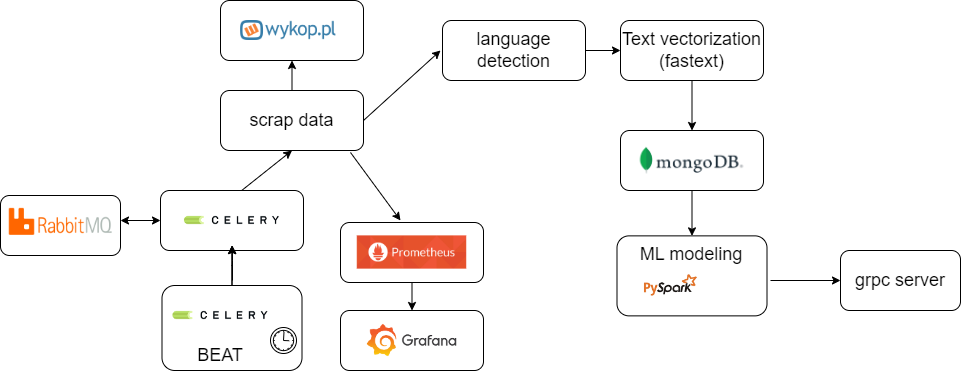

# data-processing-pipeline-wykop
This project is a machine learning pipeline which consists of componets to scrap, clean, preprocess and model data from polish social media site in order to predict number of likes for given post. Statistics about this process can be seen in grafana dashboard.

## Architecture

## Deployment
Project was deployed in 2 diffrent versions, placed in seperate directory.

**docker-only-version**

Whole project was deployed only with use of docker. To present results of ML modeling (pyspark) jupiter-notebook was used.

**helm-grpc-version**

Whole project was deployed on Kubernetes using Helm. Helm charts from Artifact Hub (mongo, grafana, graphite, rabbit) were used as well as own charts (grpc, celery-app, celery-app-beater - created from dockerfile '../docker-only-version'). In addition GRPC server was deployed in order to provide a way of communication with trained model.
