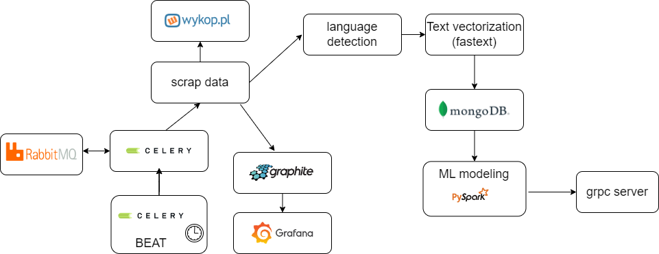

# data-processing-pipeline-wykop
This project is a machine learning pipeline which consists of componets to scrap, clean, preprocess and model data.

## Architecture

## Deployment
Project was deployed in 3 diffrent versions. Every verison is placed in seperate directory.

**docker-only-version**

Whole project was deployed only with use of docker. To present results of ML modeling (pyspark) jupiter-notebook was used.

**helm-only-version**

Whole project was deployed only with use of helm.

**helm-grpc-version**

GRPC server with ML modeling (pyspark) was deployed only with use of helm.
